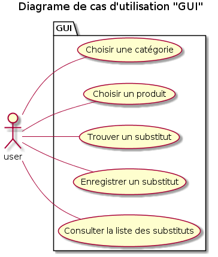
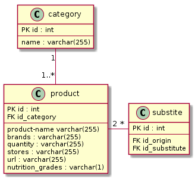

# Contexte

Pure Beurre a besoin d'une application qui permet de proposer des alternatives à un certain nombre de produits alimentaire du quotidien.

# Organisation

## la Démarche
* Initialisation du [repo sur Github](https://github.com/Zepmanbc/oc_dapython_pr5)
* Création du [Trello](https://trello.com/b/NFvfd67Q/ocdapythonpr5)
* Rédaction de la [documentation](https://github.com/Zepmanbc/oc_dapython_pr5/blob/master/doc/documentation.md)
* Analyse de l'[API OpenFoodFacts](https://en.wiki.openfoodfacts.org/API/Read/Search)

# 1 - Règles fonctionnelles

Il y aura 5 *catégories* composées de 5 *types de produits*.

La base de données sera une injection tirée d'une requête sur OpenFoofFacts, chaque *produit* sera limité à 1000 réponses.

Chaque *produit* récupèrera les informations suivantes:
* product_name
* brands
* quantity
* stores
* url

Pour chaque *types de produits*, une sélection de 9 *produits* séléctionnés aléatoirement dans la base sera proposé à l'utilisateur.

Un *produit* sera présenté par la concaténation de *product_name* + *brands* + *quantity*.

Une fois un *produit* séléctionné, *stores* et *url* seront affiché et l'utilisateur pourra sélectionner de le rajouter à ses favoris ou retourner afficher 9 autres propositions.

L'utilisateur peut afficher la liste des produits qu'il a ajouté à ses favoris, leur catégorie et type de produits sera affiché.

L'interface avec l'utilisateur se fera en mode console avec une intéraction uniquement par l'envoi de chiffres.

# 2 - Acteurs système

# 3 - Décomposition du système

# 4 - Les cas d'utilisation

# 5 - Parcours

# 6 - Solution Technique
Une base MySQL et la console.

# 7 - Diagramme de classe

# 8 - Modéle physique de données

[Script SQL](../app/static/dboff.sql)

