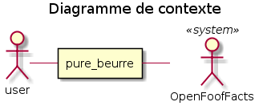
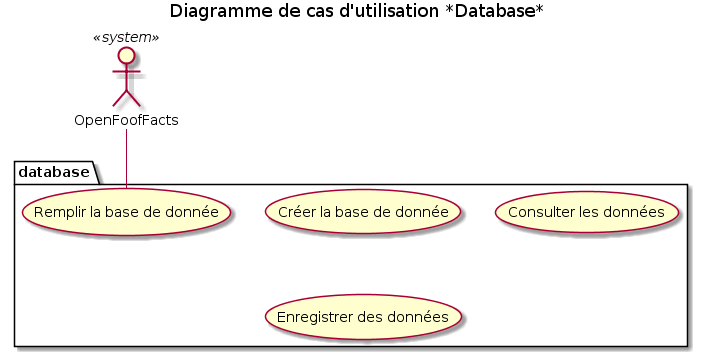

# Contexte

Pure Beurre a besoin d'une application qui permet de proposer des alternatives à un certain nombre de produits alimentaire du quotidien.

# 1 - Règles fonctionnelles

Il y aura 9 *catégories* de produits.

La base de données sera une injection tirée d'une requête sur OpenFoofFacts.

Chaque *produit* récupèrera les informations suivantes:
* product_name
* brands
* quantity
* stores
* url
* nutrition_grades_tags

Pour chaque *catégorie*, une sélection de 9 *produits* séléctionnés aléatoirement dans la base sera proposé à l'utilisateur. Il aura la possibilité de naviguer entre plusieurs pages.

Un *produit* sera présenté par la concaténation de *product_name* + *brands* + *quantity* + *nutrition_grades_tags*.

Une fois qu'un *produit* est séléctionné, une liste de *substituts* est présenté de façon identique mais uniquement avec un *nutrition_grades_tags* supérieur ou égal, le résultat sera ordonné suivant le nutrition grade a>e.

Le substitut sélectionné, les détails de celui ci sont affiché (*stores* et *url*)et il est possible d'enregistrer l'association des 2 produits.

L'utilisateur peut afficher la liste des produits qu'il a associé, ceux ci sont classés par catégorie. Il est possible de consulter les détails du *substitut*.

# 2 - Acteurs système

# 3 - Décomposition du système

# 4 - Les cas d'utilisation

# 5 - Parcours

# 6 - Solution Technique

Une base MySQL et la console.

# 7 - Diagramme de classe

# 8 - Modéle physique de données

[Script SQL](https://raw.githubusercontent.com/Zepmanbc/oc_dapython_pr5/master/app/static/inject_dboff.sql)

[Backup de la base de données](https://raw.githubusercontent.com/Zepmanbc/oc_dapython_pr5/master/doc/backup_offdb.sql)

